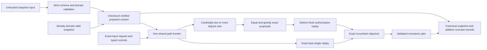

# RouteLab TS

RouteLab is a small, exact TypeScript liquidity router. Given an immutable snapshot of two-asset constant-product pools and an exact-input request, it deterministically searches within explicit hop and work limits, exactly replays every complete candidate, and returns a validated plan under exact output and deterministic tie-breaking.

It includes checksum-verified prepared contexts, a curated historical snapshot, a result-blind synthetic request corpus, bounded anytime split routing, and a path-shadow-price numerical allocator whose proposals require fresh exact authorization. See [current status](STATUS.md) for the active release task.

The supported library surface is `prepareSnapshot`, `quote`, `serializeQuote`, and `formatQuote` from `src/index.ts`. Quotes support `best-single`, `greedy-split`, and `numerical-split` with frozen `fast`, `balanced`, and `thorough` effort profiles. The default is `greedy-split` with `balanced` effort; internal iteration and replay caps are not public request fields.

## A 30-second executable example

The repository pins Node.js 24.18.0 and pnpm 11.12.0. From a clean clone:

```bash
corepack enable
corepack install --global pnpm@11.12.0
pnpm install --frozen-lockfile
pnpm verify:historical-data
pnpm verify:synthetic-requests
pnpm demo
```

`pnpm demo` executes a fixed two-pool request: exact input `100`, best-single output `50`, allocations `50/50`, and split output `66`. These are fixture facts, not performance or unrestricted-optimality claims.

`pnpm verify:historical-data` verifies the first curated historical import entirely offline. It checks the closed manifest and six declared companion artifacts, exact Infura/SQD normalized-source agreement, canonical pool ordering and financial-content checksum, and the untrusted parse-before-prepare boundary before returning a prepared context summary. The imported snapshot is a frozen 54-pool subset at one block, not a request corpus or benchmark.

`pnpm verify:synthetic-requests` first revalidates that historical import, then verifies a separately versioned 396-request corpus. The corpus exhaustively combines all 132 ordered distinct asset pairs with three exact input-asset liquidity-relative amount tiers. Its ordering, byte hash, maximum-reserve amounts, and graph-only direct/two-hop labels are independently rederived offline. It contains no runtime configuration or router results and does not model historical demand or equal-value trades.

## Why exact replay matters

Search only proposes routes. A proposal cannot become the incumbent plan until RouteLab re-executes it against the requested snapshot with exact `bigint` arithmetic and current per-hop reserve state. This boundary prevents approximate ranking, stale liquidity, invalid paths, or failed candidates from authorizing a financial result.

Every returned plan is tied to both the snapshot ID and checksum, consumes the exact requested input, and includes deterministic hop receipts. Later hops see earlier reserve transitions; no exact amount passes through a JavaScript `number`.

## Architecture



The core layers are immutable domain validation, exact constant-product transitions, exact sequential route replay, canonical bounded search, deterministic incumbent selection, and canonical serialization. Untrusted snapshot-shaped input enters through `parseAndPrepareRoutingContext`, which applies strict schema/domain parsing before checksum verification and preparation. The lower-level `prepareRoutingContext` factory accepts an already domain-validated snapshot, defensively captures it, and verifies its canonical checksum before building hidden reusable lookups and adjacency. One composed split request owns one path frontier, derives pool-disjoint sets without singleton split work, and uses six heterogeneous cumulative cap/counter kinds without recharge. Direct establishment finishes before controls are observed; equal and greedy receipts remain proposals until a distinct fresh authorization replay succeeds under the complete split objective. Cooperative stops occur between atomic work units and expose only an authorized exact incumbent or typed no-plan. Process-local resume remains single-path-only.

## Verification strategy

The repository combines hand-auditable fixtures, focused unit tests, independent oracle and differential tests, and deterministic replay cases. Tests are evidence for the accepted contracts in [docs/invariants.md](docs/invariants.md); they do not override those contracts.

```bash
pnpm verify:historical-data # Verify the curated historical import and preparation boundary offline.
pnpm verify:synthetic-requests # Verify the result-blind synthetic request corpus offline.
pnpm lint               # Run typed ESLint rules.
pnpm typecheck          # Run strict TypeScript checks without emitting files.
pnpm test               # Run production and independent-oracle tests.
pnpm demo               # Execute and report the fixed composed split fixture.
pnpm check              # Run the complete local gate.
```

CI uses the same pinned pnpm version, performs a frozen install, and runs `pnpm check`.

## Limitations

- Routing is bounded. Split routing evaluates exact no-split, canonical equal-split, and configured chunk-greedy policies over enumerated pool-disjoint route sets. Flooring and zero-output activation can make even unit chunks miss the tiny exhaustive optimum, so no unrestricted global-optimality claim is made.
- The project does not submit transactions, hold funds, integrate a deployed protocol, or provide a service.
- Checkpoints are process-local and non-serializable. Current reusable checkpoints are single-path; the composed split runtime has no resume surface. Deadline adapters require an injected monotonic clock and provide no hard-latency guarantee.
- Immediate establishment is limited to exact-replayable one-hop candidates. With no eligible direct route, a zero search cap or already-reached deadline can still return typed no-plan.
- Non-interruptible routing and canonical router-run/case v1 retain their existing zero-expansion behavior and hashes; immediate establishment is exposed by the interruptible, resumable, and deadline runtime APIs.
- The executable split demo covers one fixed offline two-pool fixture. It supports no scaling, latency, throughput, production, or unrestricted-optimality conclusion.
- `prepareRoutingContext` is a lower-level typed compatibility surface and assumes its `LiquiditySnapshot` is already domain-validated; untrusted JavaScript or imported data must use `parseAndPrepareRoutingContext`. The first curated historical dataset is imported and verified through that boundary. Its separate synthetic corpus exhaustively covers the frozen allowlist pair grid at three maximum-reserve-relative input scales, but it is not historical order flow or a representative market distribution.

## Roadmap

The v0.1 work adds one public facade, a readable CLI, a compact benchmark, a local quote service, load evidence, and a fixture-only intent adapter around the retained exact core.

See the [technical roadmap](IMPLEMENTATION_PLAN.md), [current release gate](STATUS.md), [accepted invariants](docs/invariants.md), [Milestone 0 fixture derivations](fixtures/m0/README.md), and [research references](docs/references.md).
