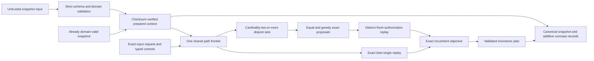

# RouteLab TS

RouteLab is a small, exact TypeScript liquidity router. Given an immutable snapshot of two-asset constant-product pools and an exact-input request, it deterministically searches within explicit hop and work limits, exactly replays every complete candidate, and returns a validated plan under exact output and deterministic tie-breaking.

It also supports canonical snapshot, single-path run/case, and additive split run/case records; checksum-verified prepared contexts; one curated, independently reconciled historical snapshot; one exhaustive result-blind synthetic request corpus with offline integrity and derivation verification; one checksummed offline composed-runtime evaluation over that corpus; a composed anytime split runtime with one shared discovery pass and request-wide typed controls; deterministic interruption and process-local single-path resume; immediate exact-replayed direct incumbents; injected cooperative deadlines; and exact pool-disjoint no-split/equal/greedy policies with a safe fallback. See [current public status](STATUS.md) for the precise integrated boundary.

## A 30-second executable example

The repository pins Node.js 24.18.0 and pnpm 11.12.0. From a clean clone:

```bash
corepack enable
corepack install --global pnpm@11.12.0
pnpm install --frozen-lockfile
pnpm verify:historical-data
pnpm verify:synthetic-requests
pnpm verify:historical-evaluation
pnpm replay:cases
pnpm replay:split-cases
pnpm demo
```

`pnpm replay:cases` reads three fixed offline cases, freshly replays their bounded router runs, verifies the canonical results and determinism hashes, and emits one JSON verification report. The success case routes `100` atomic units from asset `A` to `B` and reproduces an exact output of `90`; the other cases demonstrate typed `no-route` and work-limited `no-plan` outcomes.

The emitted JSON still uses the versioned `routelab.benchmark-report.v1` schema identifier. That identifier does not give its timing fields statistical meaning: they remain single observations, not benchmark results.

`pnpm replay:split-cases` freshly verifies two deterministic cap-driven split records. On the fixed two-pool fixture, full work reproduces exact input `100`, best single output `50`, allocations `50/50`, and split output `66`; zero discretionary caps preserve the exact direct fallback `50`. `pnpm demo` executes both composed-runtime requests against one verified prepared context and reports the exact improvement `16`. These are fixture facts, not performance or unrestricted-optimality claims.

`pnpm verify:historical-data` verifies the first curated historical import entirely offline. It checks the closed manifest and six declared companion artifacts, exact Infura/SQD normalized-source agreement, canonical pool ordering and financial-content checksum, and the untrusted parse-before-prepare boundary before returning a prepared context summary. The imported snapshot is a frozen 54-pool subset at one block, not a request corpus or benchmark.

`pnpm verify:synthetic-requests` first revalidates that historical import, then verifies a separately versioned 396-request corpus. The corpus exhaustively combines all 132 ordered distinct asset pairs with three exact input-asset liquidity-relative amount tiers. Its ordering, byte hash, maximum-reserve amounts, and graph-only direct/two-hop labels are independently rederived offline. It contains no runtime configuration or router results and does not model historical demand or equal-value trades.

`pnpm verify:historical-evaluation` revalidates those inputs once, reuses their prepared context, and freshly reproduces all 2,376 exact request/profile results from the [timing-free, prose-free comparison config and retained evaluation](datasets/evaluations/ethereum-mainnet-uniswap-v2/block-19000000/core12-v1/synthetic-exhaustive-v1/composed-two-hop-pair-v3/README.md). All 396 terminal-profile cells completed within the bounded two-hop/two-route policy, and no adjacent profile step lost a plan or regressed under the full exact objective. The separate observation config and 11,880 elapsed values are raw call-only evidence on one recorded environment, not a speedup, threshold, percentile, scaling, or production claim.

## Why exact replay matters

Search only proposes routes. A proposal cannot become the incumbent plan until RouteLab re-executes it against the requested snapshot with exact `bigint` arithmetic and current per-hop reserve state. This boundary prevents approximate ranking, stale liquidity, invalid paths, or failed candidates from authorizing a financial result.

Every returned plan is tied to both the snapshot ID and checksum, consumes the exact requested input, and includes deterministic hop receipts. Later hops see earlier reserve transitions; no exact amount passes through a JavaScript `number`.

## Architecture



The core layers are immutable domain validation, exact constant-product transitions, exact sequential route replay, canonical bounded search, deterministic incumbent selection, and canonical serialization. Untrusted snapshot-shaped input enters through `parseAndPrepareRoutingContext`, which applies strict schema/domain parsing before checksum verification and preparation. The lower-level `prepareRoutingContext` factory accepts an already domain-validated snapshot, defensively captures it, and verifies its canonical checksum before building hidden reusable lookups and adjacency. One composed split request owns one path frontier, derives pool-disjoint sets without singleton split work, and uses six heterogeneous cumulative cap/counter kinds without recharge. Direct establishment finishes before controls are observed; equal and greedy receipts remain proposals until a distinct fresh authorization replay succeeds under the complete split objective. Cooperative stops occur between atomic work units and expose only an authorized exact incumbent or typed no-plan. Process-local resume remains single-path-only.

## Verification strategy

The repository combines hand-auditable fixtures, focused unit tests, independent oracle and differential tests, deterministic replay cases, and public-surface checks. Tests are evidence for the accepted contracts in [docs/invariants.md](docs/invariants.md); they do not override those contracts.

```bash
pnpm replay:cases       # Verify fixed offline router cases and emit JSON evidence.
pnpm replay:split-cases # Verify deterministic exact split records with no timing state.
pnpm verify:historical-data # Verify the curated historical import and preparation boundary offline.
pnpm verify:synthetic-requests # Verify the result-blind synthetic request corpus offline.
pnpm verify:historical-evaluation # Freshly replay the exact composed historical evaluation.
pnpm measure:anytime    # Emit separate quality/work and repeated raw latency observations.
pnpm lint               # Run typed ESLint rules.
pnpm typecheck          # Run strict TypeScript checks without emitting files.
pnpm test               # Run production and independent-oracle tests.
pnpm demo               # Execute and report the fixed composed split fixture.
pnpm check              # Run the complete local gate.
pnpm trace:check:head   # Verify the current commit's public surface.
```

CI uses the same pinned pnpm version, performs a frozen install, and runs `pnpm check`.

## Limitations

- Routing is bounded. Split routing evaluates exact no-split, canonical equal-split, and configured chunk-greedy policies over enumerated pool-disjoint route sets. Flooring and zero-output activation can make even unit chunks miss the tiny exhaustive optimum, so no unrestricted global-optimality claim is made.
- The project does not submit transactions, hold funds, integrate a deployed protocol, or provide a service.
- Checkpoints are process-local and non-serializable. Current reusable checkpoints are single-path; the composed split runtime has no resume surface. Deadline adapters require an injected monotonic clock and provide no hard-latency guarantee.
- Immediate establishment is limited to exact-replayable one-hop candidates. With no eligible direct route, a zero search cap or already-reached deadline can still return typed no-plan.
- Non-interruptible routing and canonical router-run/case v1 retain their existing zero-expansion behavior and hashes; immediate establishment is exposed by the interruptible, resumable, and deadline runtime APIs.
- `pnpm replay:cases` remains a single-observation verification harness. `pnpm measure:anytime` uses one fixed offline input, warmups, alternating repeated samples, environment metadata, and raw observations, but performs no statistical inference and supports no speedup, threshold, scaling, or production-latency claim.
- The executable split demo and `pnpm replay:split-cases` cover one fixed offline two-pool fixture. They support no scaling, latency, throughput, production, or unrestricted-optimality conclusion.
- Legacy Milestone 2–5 routers remain standalone compatibility and component-test surfaces. The additive high-level split runtime is the composed path with a verified context, one request-local discovery frontier, and one non-recharged typed ledger.
- `prepareRoutingContext` is a lower-level typed compatibility surface and assumes its `LiquiditySnapshot` is already domain-validated; untrusted JavaScript or imported data must use `parseAndPrepareRoutingContext`. The first curated historical dataset is imported and verified through that boundary. Its separate synthetic corpus exhaustively covers the frozen allowlist pair grid at three maximum-reserve-relative input scales, but it is not historical order flow or a representative market distribution. The retained evaluation covers only that bounded synthetic grid and makes no algorithm-comparison or performance claim.

## Roadmap

The current release target is deterministic offline exact-input routing over immutable snapshots. Milestones 0–5 are integrated and cumulatively reviewed complete for their accepted gates. Milestone 6 is integrated and cumulatively reviewed complete for the additive composed-runtime prerequisite, enforced parse-before-prepare input boundary, accepted [historical-source and dataset contract](docs/adr/accepted/0003-historical-source-and-dataset-contract.md), [canonical one-snapshot import](datasets/ethereum-mainnet/uniswap-v2/block-19000000/core12-v1/README.md), separately versioned [synthetic exhaustive request corpus](datasets/requests/ethereum-mainnet-uniswap-v2/block-19000000/core12-v1/synthetic-exhaustive-v1/README.md), and [checksummed composed-runtime evaluation](datasets/evaluations/ethereum-mainnet-uniswap-v2/block-19000000/core12-v1/synthetic-exhaustive-v1/composed-two-hop-pair-v3/README.md); its exact completion commit passed CI. Milestone 7a is active. Exact replay consolidation and the accepted [path-level numerical allocation contract](docs/adr/accepted/0004-path-level-numerical-allocation.md) are integrated. The additive direct source-module numerical runtime now composes the independently verified proposal core with exact residual assignment, scoring, and distinct full-input authorization while preserving the exact no-split/equal/greedy baseline. Identical-input retained evaluation and the primary-versus-experimental decision remain pending; no historical algorithm comparison or performance result exists. Acceleration, services, protocol adapters, and learned ordering remain later gated work.

See the [technical roadmap](IMPLEMENTATION_PLAN.md), [current release gate](STATUS.md), [accepted invariants](docs/invariants.md), [Milestone 0 fixture derivations](fixtures/m0/README.md), and [research references](docs/references.md).

## Agent-assisted engineering model

RouteLab uses a bounded, human-led workflow with separate implementation, independent oracle, and read-only review roles. Stable contracts, reviewed decisions, reproducible evidence, and concise integrated outcomes remain public; active coordination, raw reports, prompts, unpublished evidence, and local tool state remain private.

See the [development model](docs/CODEX_OPERATING_MODEL.md), [review contract](docs/CODE_REVIEW.md), [task template](tasks/TASK_TEMPLATE.md), and [engineering log](docs/engineering-log/README.md). Public trace checks enforce the boundary between reviewed repository evidence and private operational material.
