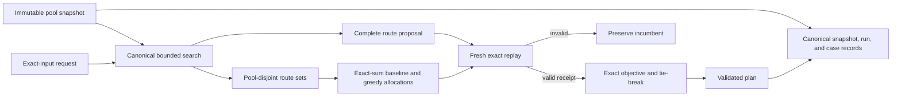

# RouteLab TS

RouteLab is a small, exact TypeScript liquidity router. Given an immutable snapshot of two-asset constant-product pools and an exact-input request, it deterministically searches within explicit hop and work limits, exactly replays every complete candidate, and returns a validated plan under exact output and deterministic tie-breaking.

It also supports canonical snapshot, run, and case records; deterministic interruption and process-local resume; immediate exact-replayed direct incumbents; injected cooperative deadlines; separate anytime quality/latency observations; and exact pool-disjoint no-split/equal/greedy baselines with a safe single-path fallback. See [current public status](STATUS.md) for the precise integrated boundary.

## A 30-second executable example

The repository pins Node.js 24.18.0 and pnpm 11.12.0. From a clean clone:

```bash
corepack enable
corepack install --global pnpm@11.12.0
pnpm install --frozen-lockfile
pnpm replay:cases
```

`pnpm replay:cases` reads three fixed offline cases, freshly replays their bounded router runs, verifies the canonical results and determinism hashes, and emits one JSON verification report. The success case routes `100` atomic units from asset `A` to `B` and reproduces an exact output of `90`; the other cases demonstrate typed `no-route` and work-limited `no-plan` outcomes.

The emitted JSON still uses the versioned `routelab.benchmark-report.v1` schema identifier. That identifier does not give its timing fields statistical meaning: they remain single observations, not benchmark results.

## Why exact replay matters

Search only proposes routes. A proposal cannot become the incumbent plan until RouteLab re-executes it against the requested snapshot with exact `bigint` arithmetic and current per-hop reserve state. This boundary prevents approximate ranking, stale liquidity, invalid paths, or failed candidates from authorizing a financial result.

Every returned plan is tied to both the snapshot ID and checksum, consumes the exact requested input, and includes deterministic hop receipts. Later hops see earlier reserve transitions; no exact amount passes through a JavaScript `number`.

## Architecture



The core layers are immutable domain validation, exact constant-product transitions, exact sequential route replay, canonical bounded search, deterministic incumbent selection, and canonical serialization. Pool-disjoint split replay evaluates each positive leg against the same captured original snapshot, exposes a receipt only after every leg succeeds, and requires allocations to sum exactly to the request. Split routing starts with an exact single-path/equal fallback; a bounded greedy policy scores exact chunk assignments but admits only a distinct fresh full-input replay under the complete split objective. Interruptible routing exact-replays every canonical direct candidate before its first user-controlled stop, then carries the best valid baseline and separate establishment accounting through reusable checkpoints. Resume and deadline adapters operate at explicit search boundaries without weakening exact replay.

## Verification strategy

The repository combines hand-auditable fixtures, focused unit tests, independent oracle and differential tests, deterministic replay cases, and public-surface checks. Tests are evidence for the accepted contracts in [docs/invariants.md](docs/invariants.md); they do not override those contracts.

```bash
pnpm replay:cases       # Verify fixed offline router cases and emit JSON evidence.
pnpm measure:anytime    # Emit separate quality/work and repeated raw latency observations.
pnpm lint               # Run typed ESLint rules.
pnpm typecheck          # Run strict TypeScript checks without emitting files.
pnpm test               # Run production and independent-oracle tests.
pnpm demo               # Print deterministic offline capability status.
pnpm check              # Run the complete local gate.
pnpm trace:check:head   # Verify the current commit's public surface.
```

CI uses the same pinned pnpm version, performs a frozen install, and runs `pnpm check`.

## Limitations

- Routing is bounded. Split routing evaluates exact no-split, canonical equal-split, and configured chunk-greedy policies over enumerated pool-disjoint route sets. Flooring and zero-output activation can make even unit chunks miss the tiny exhaustive optimum, so no unrestricted global-optimality claim is made.
- The project does not submit transactions, hold funds, integrate a deployed protocol, or provide a service.
- Checkpoints are process-local and non-serializable. Deadline adapters require an injected monotonic clock and provide no hard-latency guarantee.
- Immediate establishment is limited to exact-replayable one-hop candidates. With no eligible direct route, a zero search cap or already-reached deadline can still return typed no-plan.
- Non-interruptible routing and canonical router-run/case v1 retain their existing zero-expansion behavior and hashes; immediate establishment is exposed by the interruptible, resumable, and deadline runtime APIs.
- `pnpm replay:cases` remains a single-observation verification harness. `pnpm measure:anytime` uses one fixed offline input, warmups, alternating repeated samples, environment metadata, and raw observations, but performs no statistical inference and supports no speedup, threshold, scaling, or production-latency claim.
- The offline demo reports capability status only; use replay cases and tests for executable financial evidence.

## Roadmap

The current release target is deterministic offline exact-input routing over immutable snapshots. Milestones 0–5 are integrated and cumulatively reviewed complete. Milestone 6 historical data and credible evaluation is eligible next through a documented source decision and one provenance-checked canonical snapshot. Acceleration, services, protocol adapters, and learned ordering remain later gated work.

See the [technical roadmap](IMPLEMENTATION_PLAN.md), [current release gate](STATUS.md), [accepted invariants](docs/invariants.md), [Milestone 0 fixture derivations](fixtures/m0/README.md), and [research references](docs/references.md).

## Agent-assisted engineering model

RouteLab uses a bounded, human-led workflow with separate implementation, independent oracle, and read-only review roles. Stable contracts, reviewed decisions, reproducible evidence, and concise integrated outcomes remain public; active coordination, raw reports, prompts, unpublished evidence, and local tool state remain private.

See the [development model](docs/CODEX_OPERATING_MODEL.md), [review contract](docs/CODE_REVIEW.md), [task template](tasks/TASK_TEMPLATE.md), and [engineering log](docs/engineering-log/README.md). Public trace checks enforce the boundary between reviewed repository evidence and private operational material.
