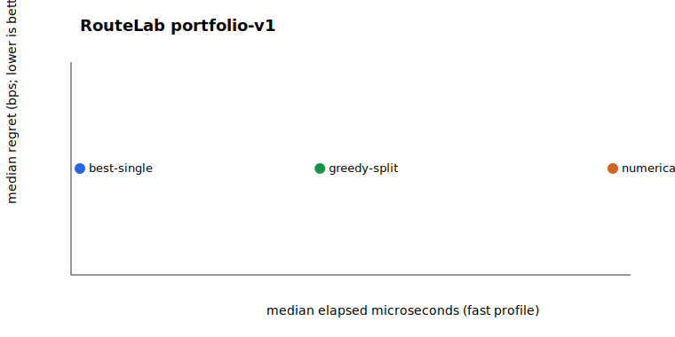

# RouteLab portfolio benchmark v1

On this retained 24-case set, every published success passed fresh exact replay. At fast effort, numerical split beat/tied/lost greedy split in 1/22/0 quoted cases. The reference is a longer-budget result over the same bounded candidate restrictions, not a global optimum.

## Deterministic quality

| Strategy | Profile | Median regret (bps) | Worst regret (bps) | Improved splits | Work | Rejections (rate/quote) |
|---|---:|---:|---:|---:|---:|---:|
| best-single | fast | 0 | 4578 | 0 | 723 | 0 (0.000) |
| greedy-split | fast | 0 | 632 | 7 | 4886 | 0 (0.000) |
| numerical-split | fast | 0 | 632 | 8 | 8693 | 0 (0.000) |
| best-single | balanced | 0 | 4578 | 0 | 723 | 0 (0.000) |
| greedy-split | balanced | 0 | 301 | 9 | 8370 | 0 (0.000) |
| numerical-split | balanced | 0 | 301 | 10 | 22370 | 0 (0.000) |
| best-single | thorough | 0 | 4578 | 0 | 723 | 0 (0.000) |
| greedy-split | thorough | 0 | 4 | 10 | 29279 | 0 (0.000) |
| numerical-split | thorough | 0 | 4 | 10 | 56905 | 0 (0.000) |
| numerical-reference | reference | 0 | 0 | 10 | 110370 | 0 (0.000) |

## In-process latency

| Strategy | Profile | Samples | p50 µs | p95 µs | p99 µs | calls/s |
|---|---:|---:|---:|---:|---:|---:|
| best-single | fast | 100 | 65 | 279 | 490 | 7539.5 |
| greedy-split | fast | 100 | 274 | 14703 | 21522 | 388.8 |
| numerical-split | fast | 100 | 529 | 25586 | 30007 | 235.5 |

## HTTP load

| Service profile | Concurrency | Requests | p50 | p95 | p99 | Throughput |
|---|---:|---:|---:|---:|---:|---:|
| greedy-split/fast | 1 | 120 | 12.63 ms | 21.41 ms | 25.92 ms | 73.9 req/s |
| greedy-split/fast | 4 | 120 | 43.65 ms | 73.22 ms | 89.78 ms | 82.6 req/s |
| greedy-split/fast | 16 | 120 | 183.02 ms | 398.68 ms | 817.45 ms | 78.0 req/s |

## Limitations

- The case set is curated and is not representative market demand.
- Snapshots are immutable offline inputs; the benchmark does not measure live acquisition or execution.
- Latency is a local observation on one machine. The synchronous router blocks its calling thread.
- Regret is measured against the bounded numerical reference and does not establish global optimality.

## Methodology

Quality covers 24 named cases and uses deterministic work caps only. Exact values remain decimal strings in the JSON report. Latency uses process.hrtime.bigint(), 10 warmups, and 100 measured calls per reported combination while rotating cases. Raw observations are ignored by Git.

Environment: v24.18.0; linux/x64; 13th Gen Intel(R) Core(TM) i9-13900H; revision 80d6eee; observed 2026-07-15T11:37:35.850Z.
