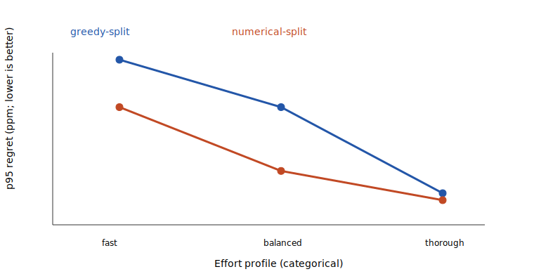

# RouteLab historical-snapshot-derived benchmark v2

All 396 requests are synthetic exact-input requests derived from one historical pool-reserve snapshot: 132 ordered asset pairs across three deterministic reserve-fraction buckets. They are not historical orders, equal-value trades, or representative demand.

Every one of the 3168 returned mode/request plans passed a fresh exact replay. 306 fixed-mode results across 221 requests beat the large-budget comparison. The 128-part comparison allocation grid and public effort grids are not nested, so a larger grid does not prove dominance; regret therefore uses the best exact result observed across every declared fixed mode.

Evidence source: e7f8c1032aa29f3a9ebf1cbf4859907fe076b138; routelab.evidence-source-paths.v1 (84 named paths); sha256:e195c5d8df3121d19f52990452a71c54f4af00b7733d015249f864ba8036c783.

At fast effort, numerical split beat/tied/lost greedy split on 19/377/0 requests.

## Deterministic quality

Regret uses integer parts per million (ppm) against the best observed exact output across all declared fixed modes. Equality with the large-budget comparison is reported separately. Displayed bps are derived as ppm / 100. Lower regret is better. Improvement ppm is relative to best-single output, which makes results comparable across token decimal domains; median and maximum improvement cover requests that improved.

| Scope | Mode | Requests | Quote/no-route | Fresh replay | = large budget | Regret p50/p90/p95/worst (ppm) | Within exact/1/10/100 bps | Improve/split/split-improve | Improvement median/max (ppm) | Counter p50/p95 | Auth rejects | Proposals attempted/converged/failed | All converged/numerical requests | Exact numerical improvements | Large budget beaten |
|---|---|---:|---:|---:|---:|---:|---:|---:|---:|---|---:|---:|---:|---:|---:|
| overall:all | best-single | 396 | 396/0 | 396 | 100 | 348/7549/20762/87734 | 10.61%/37.37%/66.41%/92.68% | 0.00%/0.00%/0.00% | n/a/n/a | pathExpansions:88/101, candidateSetExpansions:0/0, greedyOptionReplays:0/0, finalAuthorizationReplays:0/0, numericalProposals:0/0, numericalIterations:0/0, numericalAuthorizationReplays:0/0 | 0 | 0/0/0 | 0/0 | 0 | 0 |
| overall:all | greedy-split/fast | 396 | 396/0 | 396 | 105 | 82/2216/5736/87734 | 11.36%/53.03%/83.33%/96.97% | 27.02%/27.02%/27.02% | 2059/52069 | pathExpansions:88/101, candidateSetExpansions:56/110, greedyOptionReplays:406/880, finalAuthorizationReplays:0/1, numericalProposals:0/0, numericalIterations:0/0, numericalAuthorizationReplays:0/0 | 0 | 0/0/0 | 0/0 | 0 | 2 |
| overall:all | greedy-split/balanced | 396 | 396/0 | 396 | 113 | 38/1312/4016/49888 | 13.13%/62.37%/88.38%/96.97% | 39.14%/39.14%/39.14% | 2050/54550 | pathExpansions:88/101, candidateSetExpansions:56/110, greedyOptionReplays:806/1760, finalAuthorizationReplays:0/1, numericalProposals:0/0, numericalIterations:0/0, numericalAuthorizationReplays:0/0 | 0 | 0/0/0 | 0/0 | 0 | 4 |
| overall:all | greedy-split/thorough | 396 | 396/0 | 396 | 182 | 3/270/891/7126 | 25.25%/82.07%/95.45%/100.00% | 58.59%/58.59%/58.59% | 1000/88359 | pathExpansions:88/101, candidateSetExpansions:56/110, greedyOptionReplays:3206/7040, finalAuthorizationReplays:1/1, numericalProposals:0/0, numericalIterations:0/0, numericalAuthorizationReplays:0/0 | 0 | 0/0/0 | 0/0 | 0 | 23 |
| overall:all | numerical-split/fast | 396 | 396/0 | 396 | 102 | 77/2123/4016/87734 | 11.36%/54.04%/83.84%/96.97% | 31.82%/31.82%/31.82% | 1421/52069 | pathExpansions:88/101, candidateSetExpansions:56/110, greedyOptionReplays:406/880, finalAuthorizationReplays:0/1, numericalProposals:28/55, numericalIterations:448/880, numericalAuthorizationReplays:0/0 | 0 | 10758/1855/8903 | 0/396 | 19 | 10 |
| overall:all | numerical-split/balanced | 396 | 396/0 | 396 | 59 | 0/426/1700/49888 | 57.83%/82.58%/93.43%/97.47% | 80.81%/80.81%/80.81% | 420/84363 | pathExpansions:88/101, candidateSetExpansions:56/110, greedyOptionReplays:806/1760, finalAuthorizationReplays:0/1, numericalProposals:28/55, numericalIterations:1792/3520, numericalAuthorizationReplays:1/2 | 0 | 10758/5097/5661 | 0/396 | 240 | 189 |
| overall:all | numerical-split/thorough | 396 | 396/0 | 396 | 180 | 0/148/640/7126 | 41.67%/88.89%/96.46%/100.00% | 72.47%/72.47%/72.47% | 616/88359 | pathExpansions:88/101, candidateSetExpansions:56/110, greedyOptionReplays:3206/7040, finalAuthorizationReplays:1/1, numericalProposals:28/55, numericalIterations:3584/7040, numericalAuthorizationReplays:0/2 | 0 | 10758/8730/2028 | 35/396 | 83 | 78 |
| overall:all | large-budget-comparison | 396 | 396/0 | 396 | 396 | 0/52/207/4857 | 44.19%/92.93%/98.48%/100.00% | 74.75%/74.75%/74.75% | 669/96172 | pathExpansions:88/101, candidateSetExpansions:56/110, greedyOptionReplays:6406/14080, finalAuthorizationReplays:1/1, numericalProposals:28/55, numericalIterations:7168/14080, numericalAuthorizationReplays:0/1 | 0 | 10758/6962/3796 | 5/396 | 35 | 0 |

## Numerical versus greedy

| Scope | Effort | Requests | Beats/ties/loses greedy | Positive improvement median/max (ppm) |
|---|---:|---:|---:|---:|
| overall:all | fast | 396 | 19/377/0 | 24/7216 |
| overall:all | balanced | 396 | 240/156/0 | 43/29247 |
| overall:all | thorough | 396 | 82/314/0 | 33/1948 |

## In-process latency

| Mode | Warmups | Samples | Quote samples; p50/p95/p99 µs; min/max | No-route samples; p50/p95/p99 µs; min/max | Calls/s |
|---|---:|---:|---:|---:|---:|
| best-single | 50 | 1000 | 1000; 50/78/175; 35/1274 | n/a | 17629.3 |
| greedy-split/fast | 50 | 1000 | 1000; 1717/4060/4516; 622/5073 | n/a | 515.8 |
| numerical-split/fast | 50 | 1000 | 1000; 3141/7797/9379; 1155/10493 | n/a | 272.3 |
| greedy-split/balanced | 50 | 1000 | 1000; 3269/7762/8557; 1203/9660 | n/a | 271.1 |
| numerical-split/balanced | 50 | 1000 | 1000; 6154/15291/17626; 2109/22118 | n/a | 141.4 |

Fast effort is measured for all strategies, with balanced effort also measured for greedy and numerical split. Deterministic quality covers every effort. The corpus is connected with diameter two, so it contains no expected no-route request and the no-route latency distributions are explicitly `n/a`.

## Method and limitations

The corpus is ethereum-mainnet-uniswap-v2-block-19000000-core12-v1-synthetic-exhaustive-v1 (sha256:be31d0abcbd80d2364df3e5a9a62aeabf7e93fddce3b7a66f6cea66967ab74ac), bound to snapshot ethereum-mainnet-uniswap-v2-block-19000000-core12-v1 / sha256:5d21166cf218997776efc23b203c2f70637b1fb822807fb236bfc6fd0bf3e755. Every request uses maxHops=2 and maxRoutes=2. Quality is deterministic; timing uses process.hrtime.bigint(), 50 warmups and 1000 measured calls per lane with deterministic rotation through the full corpus. Raw quality rows and latency observations are ignored by Git.

The large-budget mode uses one frozen, larger bounded profile with the same route restrictions. It is a practical comparison, not a global optimum. The benchmark does not measure live acquisition, gas, transaction submission, execution, or settlement, and it does not support statistical-significance claims.

Canonical digests: request order sha256:31e9eaeec7242c204b97679a36a1862aa66bbd0f3da400b7b9cc6a69279d9c96; quality rows sha256:5637570dd11d2bb6d5ab5dfa0bc999c0fcd50825ac9b12ddbf51428bf2c849c1; aggregates sha256:dc198764cb7808ff2455cf44d5916f078b758b6a7f706e35d2a12a35cf7b0547; numerical comparisons sha256:0d0418b20655a603c22793f85375f19f237f4f61a72d689b1759e42e0a87d129.

Environment: v24.18.0; linux/x64; 13th Gen Intel(R) Core(TM) i9-13900H; source revision e7f8c1032aa29f3a9ebf1cbf4859907fe076b138; observed 2026-07-16T05:21:29.592Z.
