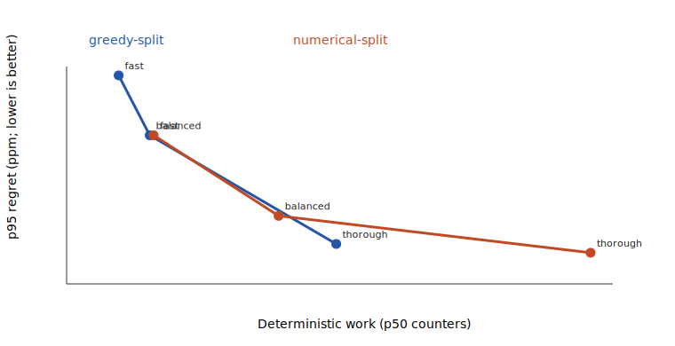
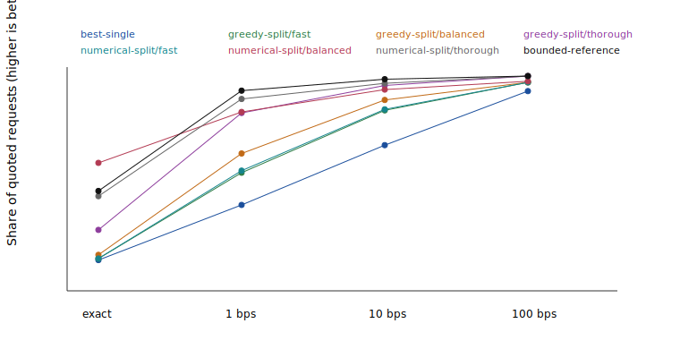

# RouteLab historical-snapshot-derived benchmark v2

All 396 requests are synthetic exact-input requests derived from one historical pool-reserve snapshot: 132 ordered asset pairs across three deterministic reserve-fraction buckets. They are not historical orders, equal-value trades, or representative demand.

Every one of the 3168 returned mode/request plans passed a fresh exact replay. 306 fixed-mode results across 221 requests beat the bounded reference. The 128-part reference allocation grid and public effort grids are not nested, so a larger grid does not prove dominance; regret therefore uses the best result observed across every declared fixed mode.

At fast effort, numerical split beat/tied/lost greedy split on 19/377/0 requests.

## Deterministic quality

Regret uses integer parts per million (ppm) against the best observed output across all declared fixed modes, including the bounded reference. Displayed bps are derived as ppm / 100. Lower regret is better. Improvement ppm is relative to best-single output, which makes results comparable across token decimal domains; median and maximum improvement cover requests that improved.

| Scope | Mode | Requests | Quote/no-route | Fresh replay | = reference | Regret p50/p90/p95/worst (ppm) | Within exact/1/10/100 bps | Improve/split/split-improve | Improvement median/max (ppm) | Work p50/p95 | Auth/proposal failures | Numerical convergence | Reference beaten |
|---|---|---:|---:|---:|---:|---:|---:|---:|---:|---:|---:|---:|---:|
| overall:all | best-single | 396 | 396/0 | 396 | 100 | 348/7549/20762/87734 | 10.61%/37.37%/66.41%/92.68% | 0.00%/0.00%/0.00% | n/a/n/a | 95/111 | 0/0 | n/a | 0 |
| amountBucket:max-reserve-1-in-100000 | best-single | 132 | 132/0 | 132 | 31 | 566/28562/62085/87734 | 13.64%/31.82%/58.33%/84.09% | 0.00%/0.00%/0.00% | n/a/n/a | 95/111 | 0/0 | n/a | 0 |
| amountBucket:max-reserve-1-in-10000 | best-single | 132 | 132/0 | 132 | 31 | 362/6434/10423/44858 | 9.85%/41.67%/61.36%/94.70% | 0.00%/0.00%/0.00% | n/a/n/a | 95/111 | 0/0 | n/a | 0 |
| amountBucket:max-reserve-1-in-1000 | best-single | 132 | 132/0 | 132 | 38 | 228/2467/3838/37670 | 8.33%/38.64%/79.55%/99.24% | 0.00%/0.00%/0.00% | n/a/n/a | 95/111 | 0/0 | n/a | 0 |
| topology:direct-edge-present | best-single | 324 | 324/0 | 324 | 78 | 335/6853/10143/65347 | 8.64%/37.35%/68.83%/94.75% | 0.00%/0.00%/0.00% | n/a/n/a | 110/111 | 0/0 | n/a | 0 |
| topology:direct-edge-absent-common-neighbor-present | best-single | 72 | 72/0 | 72 | 22 | 564/20762/56521/87734 | 19.44%/37.50%/55.56%/83.33% | 0.00%/0.00%/0.00% | n/a/n/a | 84/100 | 0/0 | n/a | 0 |
| overall:all | greedy-split/fast | 396 | 396/0 | 396 | 105 | 82/2216/5736/87734 | 11.36%/53.03%/83.33%/96.97% | 27.02%/27.02%/27.02% | 2059/52069 | 622/1156 | 0/0 | n/a | 2 |
| amountBucket:max-reserve-1-in-100000 | greedy-split/fast | 132 | 132/0 | 132 | 35 | 103/2898/62085/87734 | 15.15%/49.24%/84.85%/90.91% | 34.85%/34.85%/34.85% | 3868/52069 | 622/1156 | 0/0 | n/a | 2 |
| amountBucket:max-reserve-1-in-10000 | greedy-split/fast | 132 | 132/0 | 132 | 32 | 43/2195/3605/6947 | 10.61%/62.12%/78.79%/100.00% | 31.82%/31.82%/31.82% | 1973/45991 | 622/1156 | 0/0 | n/a | 0 |
| amountBucket:max-reserve-1-in-1000 | greedy-split/fast | 132 | 132/0 | 132 | 38 | 102/1256/2786/9698 | 8.33%/47.73%/86.36%/100.00% | 14.39%/14.39%/14.39% | 905/38363 | 622/1156 | 0/0 | n/a | 0 |
| topology:direct-edge-present | greedy-split/fast | 324 | 324/0 | 324 | 80 | 77/2082/3838/65347 | 9.26%/54.94%/84.57%/97.53% | 26.85%/26.85%/26.85% | 1544/38363 | 642/1156 | 0/0 | n/a | 1 |
| topology:direct-edge-absent-common-neighbor-present | greedy-split/fast | 72 | 72/0 | 72 | 25 | 228/2786/56521/87734 | 20.83%/44.44%/77.78%/94.44% | 27.78%/27.78%/27.78% | 4433/52069 | 284/425 | 0/0 | n/a | 1 |
| overall:all | greedy-split/balanced | 396 | 396/0 | 396 | 113 | 38/1312/4016/49888 | 13.13%/62.37%/88.38%/96.97% | 39.14%/39.14%/39.14% | 2050/54550 | 1070/2036 | 0/0 | n/a | 4 |
| amountBucket:max-reserve-1-in-100000 | greedy-split/balanced | 132 | 132/0 | 132 | 38 | 35/1700/30461/49888 | 17.42%/60.61%/84.85%/90.91% | 53.79%/53.79%/53.79% | 4175/54550 | 1070/2036 | 0/0 | n/a | 3 |
| amountBucket:max-reserve-1-in-10000 | greedy-split/balanced | 132 | 132/0 | 132 | 36 | 20/1372/2582/6947 | 13.64%/71.97%/87.12%/100.00% | 38.64%/38.64%/38.64% | 2050/46964 | 1070/2036 | 0/0 | n/a | 1 |
| amountBucket:max-reserve-1-in-1000 | greedy-split/balanced | 132 | 132/0 | 132 | 39 | 83/751/1698/7626 | 8.33%/54.55%/93.18%/100.00% | 25.00%/25.00%/25.00% | 713/38363 | 1070/2036 | 0/0 | n/a | 0 |
| topology:direct-edge-present | greedy-split/balanced | 324 | 324/0 | 324 | 86 | 37/1068/2906/32352 | 11.11%/64.20%/89.51%/97.53% | 39.81%/39.81%/39.81% | 1454/38363 | 1090/2036 | 0/0 | n/a | 3 |
| topology:direct-edge-absent-common-neighbor-present | greedy-split/balanced | 72 | 72/0 | 72 | 27 | 46/2366/27493/49888 | 22.22%/54.17%/83.33%/94.44% | 36.11%/36.11%/36.11% | 5407/54550 | 444/706 | 0/0 | n/a | 1 |
| overall:all | greedy-split/thorough | 396 | 396/0 | 396 | 182 | 3/270/891/7126 | 25.25%/82.07%/95.45%/100.00% | 58.59%/58.59%/58.59% | 1000/88359 | 3758/7316 | 0/0 | n/a | 23 |
| amountBucket:max-reserve-1-in-100000 | greedy-split/thorough | 132 | 132/0 | 132 | 67 | 0/65/272/7126 | 37.12%/90.91%/98.48%/100.00% | 75.00%/75.00%/75.00% | 1340/88359 | 3758/7316 | 0/0 | n/a | 19 |
| amountBucket:max-reserve-1-in-10000 | greedy-split/thorough | 132 | 132/0 | 132 | 60 | 3/569/2582/6947 | 22.73%/86.36%/90.91%/100.00% | 54.55%/54.55%/54.55% | 1078/46964 | 3758/7316 | 0/0 | n/a | 2 |
| amountBucket:max-reserve-1-in-1000 | greedy-split/thorough | 132 | 132/0 | 132 | 55 | 20/362/814/1944 | 15.91%/68.94%/96.97%/100.00% | 46.21%/46.21%/46.21% | 704/39125 | 3758/7316 | 0/0 | n/a | 2 |
| topology:direct-edge-present | greedy-split/thorough | 324 | 324/0 | 324 | 145 | 3/243/676/6947 | 23.77%/83.64%/95.99%/100.00% | 59.57%/59.57%/59.57% | 828/69915 | 3778/7316 | 0/0 | n/a | 15 |
| topology:direct-edge-absent-common-neighbor-present | greedy-split/thorough | 72 | 72/0 | 72 | 37 | 1/564/2582/7126 | 31.94%/75.00%/93.06%/100.00% | 54.17%/54.17%/54.17% | 2371/88359 | 1404/2386 | 0/0 | n/a | 8 |
| overall:all | numerical-split/fast | 396 | 396/0 | 396 | 102 | 77/2123/4016/87734 | 11.36%/54.04%/83.84%/96.97% | 31.82%/31.82%/31.82% | 1421/52069 | 1126/2150 | 0/8903 | 0.00% | 10 |
| amountBucket:max-reserve-1-in-100000 | numerical-split/fast | 132 | 132/0 | 132 | 35 | 103/2898/62085/87734 | 15.15%/49.24%/84.85%/90.91% | 34.85%/34.85%/34.85% | 3868/52069 | 1126/2150 | 0/2827 | 0.00% | 2 |
| amountBucket:max-reserve-1-in-10000 | numerical-split/fast | 132 | 132/0 | 132 | 31 | 40/2195/3605/6947 | 10.61%/62.12%/78.79%/100.00% | 34.85%/34.85%/34.85% | 1432/45991 | 1126/2150 | 0/2969 | 0.00% | 2 |
| amountBucket:max-reserve-1-in-1000 | numerical-split/fast | 132 | 132/0 | 132 | 36 | 97/1104/2334/9686 | 8.33%/50.76%/87.88%/100.00% | 25.76%/25.76%/25.76% | 333/38363 | 1126/2149 | 0/3107 | 0.00% | 6 |
| topology:direct-edge-present | numerical-split/fast | 324 | 324/0 | 324 | 79 | 68/1921/3797/65347 | 9.26%/55.86%/85.19%/97.53% | 31.79%/31.79%/31.79% | 1222/38363 | 1148/2150 | 0/8191 | 0.00% | 6 |
| topology:direct-edge-absent-common-neighbor-present | numerical-split/fast | 72 | 72/0 | 72 | 23 | 210/2786/56521/87734 | 20.83%/45.83%/77.78%/94.44% | 31.94%/31.94%/31.94% | 3920/52069 | 466/696 | 0/712 | 0.00% | 4 |
| overall:all | numerical-split/balanced | 396 | 396/0 | 396 | 59 | 0/426/1700/49888 | 57.83%/82.58%/93.43%/97.47% | 80.81%/80.81%/80.81% | 420/84363 | 2927/5692 | 0/5661 | 0.00% | 189 |
| amountBucket:max-reserve-1-in-100000 | numerical-split/balanced | 132 | 132/0 | 132 | 26 | 0/953/30461/49888 | 56.06%/77.27%/90.15%/92.42% | 77.27%/77.27%/77.27% | 995/84363 | 2925/5689 | 0/1890 | 0.00% | 51 |
| amountBucket:max-reserve-1-in-10000 | numerical-split/balanced | 132 | 132/0 | 132 | 20 | 0/462/1237/3894 | 62.12%/86.36%/93.18%/100.00% | 82.58%/82.58%/82.58% | 420/46964 | 2926/5692 | 0/1872 | 0.00% | 66 |
| amountBucket:max-reserve-1-in-1000 | numerical-split/balanced | 132 | 132/0 | 132 | 13 | 0/232/426/3661 | 55.30%/84.09%/96.97%/100.00% | 82.58%/82.58%/82.58% | 228/39144 | 2929/5692 | 0/1899 | 0.00% | 72 |
| topology:direct-edge-present | numerical-split/balanced | 324 | 324/0 | 324 | 43 | 0/365/1444/32352 | 57.10%/83.64%/94.14%/97.53% | 83.02%/83.02%/83.02% | 368/39144 | 2950/5692 | 0/5206 | 0.00% | 157 |
| topology:direct-edge-absent-common-neighbor-present | numerical-split/balanced | 72 | 72/0 | 72 | 16 | 0/663/3605/49888 | 61.11%/77.78%/90.28%/97.22% | 70.83%/70.83%/70.83% | 1307/84363 | 1112/1699 | 0/455 | 0.00% | 32 |
| overall:all | numerical-split/thorough | 396 | 396/0 | 396 | 180 | 0/148/640/7126 | 41.67%/88.89%/96.46%/100.00% | 72.47%/72.47%/72.47% | 616/88359 | 7424/14520 | 0/2028 | 8.84% | 78 |
| amountBucket:max-reserve-1-in-100000 | numerical-split/thorough | 132 | 132/0 | 132 | 61 | 0/65/272/7126 | 41.67%/90.91%/98.48%/100.00% | 78.03%/78.03%/78.03% | 1222/88359 | 7422/14520 | 0/943 | 1.52% | 27 |
| amountBucket:max-reserve-1-in-10000 | numerical-split/thorough | 132 | 132/0 | 132 | 61 | 0/89/2582/6947 | 37.12%/90.15%/90.91%/100.00% | 66.67%/66.67%/66.67% | 669/46965 | 7422/14519 | 0/627 | 6.06% | 18 |
| amountBucket:max-reserve-1-in-1000 | numerical-split/thorough | 132 | 132/0 | 132 | 58 | 0/211/262/891 | 46.21%/85.61%/100.00%/100.00% | 72.73%/72.73%/72.73% | 344/39144 | 7424/14521 | 0/458 | 18.94% | 33 |
| topology:direct-edge-present | numerical-split/thorough | 324 | 324/0 | 324 | 147 | 0/87/250/6947 | 40.43%/90.74%/97.22%/100.00% | 73.46%/73.46%/73.46% | 573/69915 | 7452/14521 | 0/1827 | 7.10% | 60 |
| topology:direct-edge-absent-common-neighbor-present | numerical-split/thorough | 72 | 72/0 | 72 | 33 | 0/418/2582/7126 | 47.22%/80.56%/93.06%/100.00% | 68.06%/68.06%/68.06% | 1340/88359 | 2713/4352 | 0/201 | 16.67% | 18 |
| overall:all | bounded-reference | 396 | 396/0 | 396 | 396 | 0/52/207/4857 | 44.19%/92.93%/98.48%/100.00% | 74.75%/74.75%/74.75% | 669/96172 | 14589/28591 | 0/3796 | 1.26% | 0 |
| amountBucket:max-reserve-1-in-100000 | bounded-reference | 132 | 132/0 | 132 | 132 | 0/35/148/4214 | 49.24%/94.70%/98.48%/100.00% | 76.52%/76.52%/76.52% | 1307/96172 | 14589/28579 | 0/1584 | 0.76% | 0 |
| amountBucket:max-reserve-1-in-10000 | bounded-reference | 132 | 132/0 | 132 | 132 | 0/47/89/4857 | 45.45%/96.21%/96.97%/100.00% | 76.52%/76.52%/76.52% | 884/46964 | 14588/28589 | 0/1276 | 1.52% | 0 |
| amountBucket:max-reserve-1-in-1000 | bounded-reference | 132 | 132/0 | 132 | 132 | 0/109/319/945 | 37.88%/87.88%/100.00%/100.00% | 71.21%/71.21%/71.21% | 304/39144 | 14590/28592 | 0/936 | 1.52% | 0 |
| topology:direct-edge-present | bounded-reference | 324 | 324/0 | 324 | 324 | 0/52/124/4857 | 44.14%/93.83%/98.46%/100.00% | 75.93%/75.93%/75.93% | 583/69915 | 14619/28592 | 0/3447 | 0.62% | 0 |
| topology:direct-edge-absent-common-neighbor-present | bounded-reference | 72 | 72/0 | 72 | 72 | 0/148/272/2508 | 44.44%/88.89%/98.61%/100.00% | 69.44%/69.44%/69.44% | 1769/96172 | 5272/8512 | 0/349 | 4.17% | 0 |

## Numerical versus greedy

| Scope | Effort | Requests | Beats/ties/loses greedy | Positive improvement median/max (ppm) | Additional work |
|---|---:|---:|---:|---:|---:|
| overall:all | fast | 396 | 19/377/0 | 24/7216 | 194174 |
| amountBucket:max-reserve-1-in-100000 | fast | 132 | 0/132/0 | n/a/n/a | 64684 |
| amountBucket:max-reserve-1-in-10000 | fast | 132 | 4/128/0 | 6/52 | 64743 |
| amountBucket:max-reserve-1-in-1000 | fast | 132 | 15/117/0 | 33/7216 | 64747 |
| topology:direct-edge-present | fast | 324 | 16/308/0 | 24/7216 | 178460 |
| topology:direct-edge-absent-common-neighbor-present | fast | 72 | 3/69/0 | 17/564 | 15714 |
| overall:all | balanced | 396 | 240/156/0 | 43/29247 | 714767 |
| amountBucket:max-reserve-1-in-100000 | balanced | 132 | 61/71/0 | 38/29247 | 238070 |
| amountBucket:max-reserve-1-in-10000 | balanced | 132 | 83/49/0 | 35/6996 | 238279 |
| amountBucket:max-reserve-1-in-1000 | balanced | 132 | 96/36/0 | 85/7684 | 238418 |
| topology:direct-edge-present | balanced | 324 | 203/121/0 | 40/7684 | 656995 |
| topology:direct-edge-absent-common-neighbor-present | balanced | 72 | 37/35/0 | 136/29247 | 57772 |
| overall:all | thorough | 396 | 82/314/0 | 33/1948 | 1410679 |
| amountBucket:max-reserve-1-in-100000 | thorough | 132 | 8/124/0 | 1/4 | 469833 |
| amountBucket:max-reserve-1-in-10000 | thorough | 132 | 25/107/0 | 27/647 | 470363 |
| amountBucket:max-reserve-1-in-1000 | thorough | 132 | 49/83/0 | 83/1948 | 470483 |
| topology:direct-edge-present | thorough | 324 | 68/256/0 | 33/1948 | 1296660 |
| topology:direct-edge-absent-common-neighbor-present | thorough | 72 | 14/58/0 | 2/564 | 114019 |

## In-process latency

| Mode | Warmups | Samples | Quote samples; p50/p95/p99 µs; min/max | No-route samples; p50/p95/p99 µs; min/max | Calls/s |
|---|---:|---:|---:|---:|---:|
| best-single | 50 | 1000 | 1000; 45/64/103; 32/1040 | n/a | 20288.0 |
| greedy-split/fast | 50 | 1000 | 1000; 1550/3598/4033; 611/4802 | n/a | 570.7 |
| numerical-split/fast | 50 | 1000 | 1000; 2812/6909/7959; 1029/8552 | n/a | 311.1 |
| greedy-split/balanced | 50 | 1000 | 1000; 2938/6840/7292; 1140/7826 | n/a | 305.3 |
| numerical-split/balanced | 50 | 1000 | 1000; 5479/13749/15668; 1996/18149 | n/a | 158.9 |

Fast effort is measured for all strategies, with balanced effort also measured for greedy and numerical split. Deterministic quality covers every effort. The corpus is connected with diameter two, so it contains no expected no-route request and the no-route latency distributions are explicitly `n/a`.

## Method and limitations

The corpus is ethereum-mainnet-uniswap-v2-block-19000000-core12-v1-synthetic-exhaustive-v1 (sha256:c470f0a33b5d03cdd1ac8d88c92a8e2ec79b78f7d488541c0f4a321ff3e03173), bound to snapshot ethereum-mainnet-uniswap-v2-block-19000000-core12-v1 / sha256:5d21166cf218997776efc23b203c2f70637b1fb822807fb236bfc6fd0bf3e755. Every request uses maxHops=2 and maxRoutes=2. Quality is deterministic; timing uses process.hrtime.bigint(), 50 warmups and 1000 measured calls per lane with deterministic rotation through the full corpus. Raw quality rows and latency observations are ignored by Git.

The numerical reference uses one frozen, larger bounded profile with the same route restrictions. It is a comparison profile, not a global optimum. The benchmark does not measure live acquisition, gas, transaction submission, execution, or settlement, and it does not support statistical-significance claims.

Canonical digests: request order sha256:31e9eaeec7242c204b97679a36a1862aa66bbd0f3da400b7b9cc6a69279d9c96; quality rows sha256:0b068559182a37dc4fc4ff4bbaea332a79779693a193596d39eaef97af89de05; aggregates sha256:b697af51d1a0db7ab288661c96a42a6cd1e2e92c61420c57a26bdbafc10e2024; numerical comparisons sha256:3bc277a9808fcd605f62a7a7da792e5eb558ac57698dab8fa03eaa13fbdf36a1.

Environment: v24.18.0; linux/x64; 13th Gen Intel(R) Core(TM) i9-13900H; revision 8527e88; observed 2026-07-15T23:37:24.804Z.
