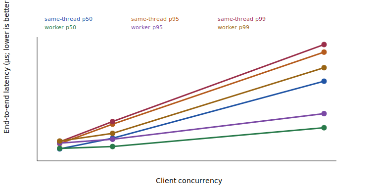

# RouteLab isolated service performance v2

The load generator and quote server run in separate processes over localhost. Same-thread mode retains 1 active synchronous quote; worker mode uses 4 fixed workers. Both modes retain at most 32 queued quotes, with typed 503 overload responses.

Evidence source: 8babed2e2a7d1101980757777e06043eea5bc4e9; routelab.evidence-source-paths.v1 (90 named paths); sha256:cd363964aa8f3f5c3ea27b181720704f3adc9268d2ab207987c54053bc79980c.

| Mode | Concurrency | Requests | Completed/typed error/timeout/schema failure | Client success p50/p95/p99 ms | Error response p50/p95/p99 ms | req/s | Exact output/fingerprint/semantic match | Deadline completion | Quote service p50/p95/p99 ms | Event-loop p95/max ms | Accepted/rejected/overload | Max active/queued | Terminations | Route counts | RSS initial/peak/final MiB | Heap initial/peak/final MiB |
|---|---:|---:|---:|---:|---:|---:|---:|---:|---:|---:|---:|---:|---:|---:|---:|---:|
| same-thread | 1 | 1000 | 1000/0/0/0 | 3.49/6.13/7.32 | n/a | 257.8 | 1000/1000/1000 | 100.00% | 1.78/4.28/5.27 | 13.54/15.92 | 1000/0/0 | 1/0 | complete:1000 | 1:720, 2:280 | 119.2/180.0/180.0 | 19.0/53.1/22.9 |
| same-thread | 4 | 1000 | 1000/0/0/0 | 8.50/15.52/16.75 | n/a | 433.4 | 1000/1000/1000 | 100.00% | 1.79/4.14/4.86 | 13.51/15.15 | 1000/0/0 | 1/2 | complete:1000 | 1:720, 2:280 | 180.5/234.5/234.5 | 27.3/85.3/58.6 |
| same-thread | 16 | 1000 | 1000/0/0/0 | 37.97/52.44/56.73 | n/a | 425.1 | 1000/1000/1000 | 100.00% | 1.86/4.26/4.96 | 13.39/14.93 | 1000/0/0 | 1/14 | complete:1000 | 1:720, 2:280 | 238.1/250.8/250.8 | 72.1/95.5/44.7 |
| worker | 1 | 1000 | 1000/0/0/0 | 3.67/7.17/10.13 | n/a | 232.3 | 1000/1000/1000 | 100.00% | 2.00/4.69/7.15 | 10.80/11.32 | 1000/0/0 | 1/0 | complete:1000 | 1:720, 2:280 | 217.1/283.4/283.4 | 13.8/22.0/22.0 |
| worker | 4 | 1000 | 1000/0/0/0 | 4.97/9.73/13.77 | n/a | 694.1 | 1000/1000/1000 | 100.00% | 3.06/7.37/11.10 | 10.66/11.12 | 1000/0/0 | 4/0 | complete:1000 | 1:720, 2:280 | 284.2/377.7/377.7 | 19.6/33.6/24.5 |
| worker | 16 | 1000 | 1000/0/0/0 | 16.46/26.89/36.27 | n/a | 923.3 | 1000/1000/1000 | 100.00% | 3.55/8.00/10.87 | 10.96/23.05 | 1000/0/0 | 4/12 | complete:1000 | 1:720, 2:280 | 377.7/409.0/409.0 | 25.7/36.7/33.2 |

## Worker decision

Decision: **retained**. The frozen semantic, tail, throughput, c1 overhead, admission, and memory gates passed.

Frozen gate measurements: semantic/schema=true; tail=p95 487262 ppm; event-loop max=-544420 ppm; c16 throughput ratio=2171905 ppm; c1 p50 overhead=182 µs; no lost requests=true; memory reported=true.

The frozen retention thresholds are: no semantic/schema regression; at least 25% c16 p95 or p99 improvement, or at least 50% event-loop max improvement; c16 throughput at least 90% of baseline; c1 p50 overhead no more than 2 ms; no lost requests; and reported memory cost.

## Deadline sweep

| Deadline | Requests | Complete/deadline incumbent/before plan/overload/timeout/failure | Exact valid | Complete p50/p95/p99 ms | Deadline incumbent p50/p95/p99 ms | Error p50/p95/p99 ms |
|---:|---:|---:|---:|---:|---:|---:|
| 25 ms | 200 | 31/161/8/0/0/0 | 192 | 23.47/27.09/n/a | 27.24/28.73/n/a | 28.37/29.24/n/a |
| 50 ms | 200 | 153/47/0/0/0/0 | 200 | 40.85/51.49/n/a | 52.05/53.22/n/a | n/a |
| 100 ms | 200 | 200/0/0/0/0/0 | 200 | 49.41/72.39/n/a | n/a | n/a |

Deadline outcomes are classified separately from the normal successful-latency distribution. Every complete or deadline-incumbent quote counted above passed exact replay and fingerprint validation in the load-generator process.

## Bounded overload burst

The deterministic 52-request burst exceeded 4 active plus 32 queued work slots: 36 were accepted and exactly validated, 16 received typed 503 overloaded responses, and all 16 overload responses carried Retry-After. Maximum observed queue depth was 32.

## Method and limitations

The load-generator process owns concurrency scheduling, client timeouts, end-to-end latency, response validation, and client aggregation. The server child alone owns admission, structured completion logs, quote execution, event-loop delay, and server memory metrics.

Each normal retained row rotates all 396 requests in deterministic corpus order, uses 50 warmups and 1000 measured requests, greedy-split/fast, a 5000 ms end-to-end quote deadline, and a 10000 ms client timeout. Same-thread is shut down before worker mode starts; no prior report is read as a baseline. Successful and error-response latency are separate; p99 is omitted below 1,000 observations. Server event-loop and memory metrics come only from the server process.

The requests are synthetic exact-input requests derived from one historical pool-reserve snapshot, not historical order flow or representative demand. This local result is not a production-capacity or statistical-significance claim. No live upstream, transaction submission, signing, custody, execution, or settlement is involved.

Environment: v24.18.0; linux/x64; 13th Gen Intel(R) Core(TM) i9-13900H; source revision 8babed2e2a7d1101980757777e06043eea5bc4e9; observed 2026-07-16T03:27:16.386Z.

